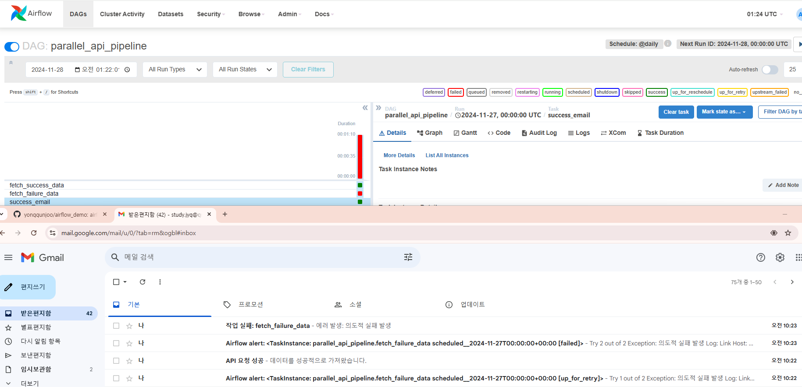

# Airflow 기술 확보 프로젝트

## 목차
1. [기술 분석](#1-기술-분석)
2. [프로젝트 계획](#2-프로젝트-계획)
3. [시스템 설계](#3-시스템-설계)
4. [구현 가이드](#4-구현-가이드)
5. [테스트 및 검증](#5-테스트-및-검증)
6. [결론](#6-결론)

## 1. 기술 분석

### 1.1 Airflow 핵심 아키텍처
- **DAG (Directed Acyclic Graph)**
  - 워크플로우를 정의하는 기본 단위
  - 작업 간의 의존성을 방향성 있는 그래프로 표현

### 1.2 핵심 구성 요소
- **Operators**
  - BashOperator: 쉘 명령어 실행
  - PythonOperator: Python 코드 실행
  - EmailOperator: 이메일 발송

- **Tasks**
  - Operator의 구체적 인스턴스
  - DAG 내에서 실제 수행되는 작업 단위

- **Dependencies**
  - `>>`, `<<` 연산자를 통한 작업 순서 정의
  - 작업 간 실행 순서와 조건 설정

### 1.3 핵심 기능
- **스케줄링**
  - Airflow는 두 가지 방식으로 실행 일정을 관리
    - Cron 표현식 지원: `0 12 * * *`
    - 미리 정의된 간격: `@daily`, `@hourly`

- **실행 관리**
  - 워크플로우 실행은 다음과 같은 방식으로 관리
    - Trigger: 수동/자동 실행
    - Backfill: 과거 데이터 처리
    - Catchup: 누락 실행 보완

- **오류 처리**
  - 시스템은 다음과 같은 오류 처리 메커니즘을 제공
    - Retries: 자동 재시도
    - Alerts: 이메일/Slack 알림

## 2. 프로젝트 계획

### 2.1 목표
1. Airflow 기반 데이터 파이프라인 자동화 구현
2. 실무 적용 가능한 데모 시스템 구축
3. 팀 내 기술 역량 강화

### 2.2 범위
- Airflow 핵심 기능 분석 및 문서화
- 로컬 환경 기반 데모 시스템 구현
- Gmail 기반 알림 시스템 구축

### 2.3 기대 효과
- 데이터 파이프라인 자동화로 업무 효율성 향상
- 안정적인 워크플로우 관리 체계 확립
- 신속한 장애 대응 능력 확보

## 3. 시스템 설계

### 3.1 아키텍처 설계
1. **핵심 컴포넌트**
   - DAG 실행 엔진
   - 스케줄러
   - 작업 실행기
   - 알림 시스템 (gamil)

2. **워크플로우 설계**
   - API 데이터 수집 파이프라인
   - 병렬 처리 파이프라인
   - 오류 처리 및 알림 시스템

## 4. 구현 가이드

### 4.1 환경 구성
```bash
# 필수 소프트웨어
- vscode
- python
- docker
- airflow:2.9.3

# 설치 절차
1. 저장소 복제
$ git clone https://github.com/yonggunjoo/airflow_demo.git
$ cd ${path}/airflow_demo

2. Python 환경 설정
$ python -m venv ./demo-env
$ demo-env\Scripts\activate
$ pip install -r requirements.txt

3. Docker 실행
$ docker-compose -f docker-compose.yaml up -d
```

### 4.2 SMTP 설정
```yaml
# docker-compose.yaml 설정
x-airflow-common:
  environment:
    AIRFLOW__SMTP__SMTP_HOST: 'smtp.gmail.com'
    AIRFLOW__SMTP__SMTP_USER: ''        # Gmail 계정
    AIRFLOW__SMTP__SMTP_PASSWORD: ''    # Gmail 앱 비밀번호
    AIRFLOW__SMTP__SMTP_PORT: 587
    AIRFLOW__SMTP__SMTP_MAIL_FROM: ''   # 발신자 이메일
```

### 4.3 구현된 DAG
1. **api_data_pipeline**
   - 단일 API 호출 및 성공 메시지 발송
   - 경로: [api_data_pipeline](dags/api_data_pipeline.py)

2. **parallel_api_pipeline**
   - 복수 API 병렬 처리
   - 성공/실패 메일 발송
   - 실패 시 1회 재시도
   - 경로: [parallel_api_pipeline](dags/parallel_api_pipeline.py)

## 5. 테스트 및 검증

### 5.1 접속 정보
- URL: localhost:8080
- 기본 계정: airflow/airflow

### 5.2 테스트 항목
1. **기능 테스트**
   - API 연동 검증
   - 데이터 처리 정확성
   - 이메일 알림 동작

2. **오류 처리 테스트**
   - 작업 실패 시 재시도
   - 알림 발송 확인

### 5.3 테스트 결과
  
- 성공 메일: 1건
- Retry 시도: 2건
- 최종 실패 메일: 1건

## 6. 결론
본 프로젝트를 통해 Airflow 기반의 안정적인 데이터 파이프라인 자동화 시스템을 구축했습니다. 지속적인 모니터링과 개선을 통해 시스템의 안정성을 확보하며, 실제 업무에 즉시 적용 가능한 수준의 기술력을 확보했습니다.
